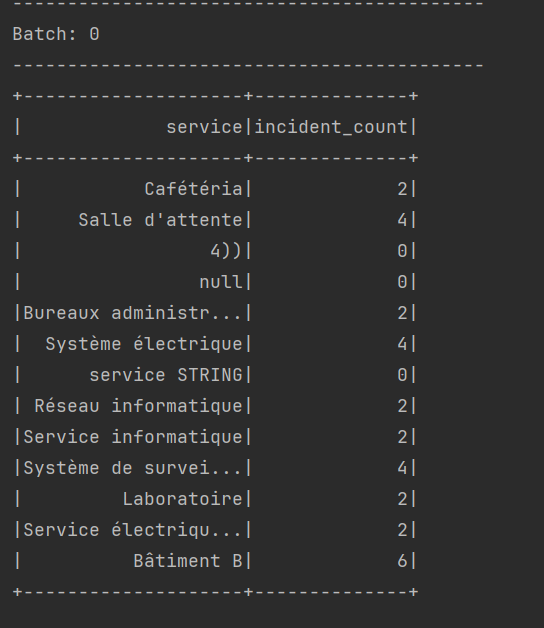
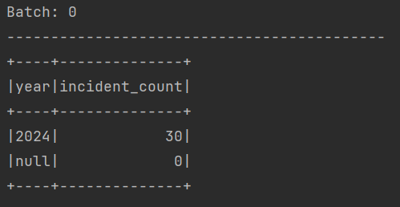

# Application de Streaming d'Incidents Hospitaliers

## Aperçu
L'application de Streaming d'Incidents Hospitaliers est conçue pour traiter et analyser des données en continu liées aux incidents dans un contexte hospitalier. Elle utilise Apache Spark et Apache Spark SQL pour effectuer des analyses en temps réel sur les données entrantes.

## Dépendances
- **Apache Spark :** L'application dépend d'Apache Spark pour le traitement distribué des données.
- **Apache Log4j :** Log4j est utilisé pour la journalisation. Le niveau de journalisation est défini sur ERROR pour le package "org.apache.spark" et INFO pour le package "org.example".

## Fonctionnalités

### Tâche 1 : Nombre d'Incidents par Service
L'application surveille en continu et affiche le nombre d'incidents par service. Elle réalise cela en lisant les données en streaming à partir d'un répertoire spécifié, en définissant un schéma pour les données, en regroupant les données par le champ "service", et en calculant le nombre d'incidents. Les résultats sont ensuite affichés en temps réel dans la console.

### Tâche 2 : Deux Années avec le Plus Grand Nombre d'Incidents
L'application affiche également en continu les deux années avec le plus grand nombre d'incidents. Elle extrait l'année du champ "date", regroupe les données par année, calcule le nombre d'incidents, ordonne les résultats par ordre décroissant, et limite la sortie aux deux années les plus élevées. Les résultats sont affichés en temps réel dans la console.

## Utilisation

### Configuration
- La session Spark est configurée avec le nom d'application "HospitalIncidentStreaming" et s'exécute localement avec deux threads de traitement. Pour le déploiement sur un cluster YARN, le maître peut être modifié en "yarn".

### Source de Données en Streaming
- L'application lit les données en streaming à partir d'un répertoire spécifié en utilisant le format CSV. Le schéma pour les données en streaming est défini avec les champs suivants : Id (INT), titre (STRING), description (STRING), service (STRING), et date (STRING).

### Sortie
- Les résultats des deux tâches sont affichés dans la console en utilisant l'API writeStream de Spark avec le mode de sortie "Complete".

## Exécution
- La classe principale de l'application est "Main" et peut être exécutée pour démarrer les requêtes en streaming. L'exécution implique deux tâches, chacune représentée par une StreamingQuery distincte : une pour afficher le nombre d'incidents par service et une autre pour afficher les deux années avec le plus grand nombre d'incidents. L'application attend la fin du traitement en streaming en utilisant la méthode awaitTermination().

<table border="1">
    <tr>
        <th>Nombre d'Incidents par Service</th>
        <th>Deux Années avec le Plus Grand Nombre d'Incidents</th>
    </tr>
    <tr>
        <td></td>
        <td></td>
    </tr>

 
</table>